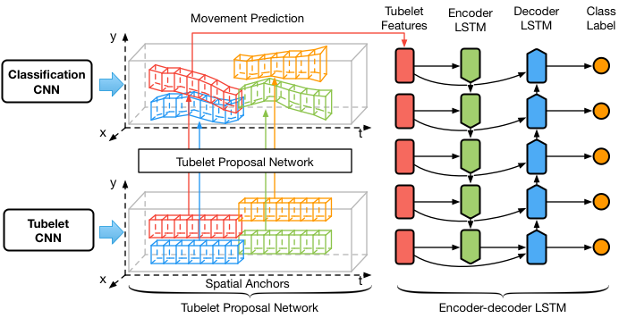

# TPN: Tubelet Proposal Network

## Introduction
`TPN`, short for `Tubelet Proposal Network`, is a deep learning framework for video object detection, originally designed for ImageNet VID dataset.

This framework mainly contains two components shown below:


The `Tubelet Proposal Network` generates hundreds of tubelet proposals based on static image box proposals, and the `Encoder-decoder LSTM` encodes the tubelet visual features into memory and decodes the information to classify each tubelet box proposal into different classes. More details in the [paper](https://arxiv.org/pdf/1702.06355) in `CVPR 2017`.

## Citation
If you are using the `TPN` code in your project, please cite the following [publication](https://arxiv.org/pdf/1702.06355).

```latex
@inproceedings{kang2017tpn,
  title={Object Detection in Videos with Tubelet Proposal Networks},
  author={Kang, Kai and Li, Hongsheng and Xiao, Tong and Ouyang, Wanli and Yan, Junjie and Liu, Xihui and Wang, Xiaogang},
  Booktitle = {CVPR},
  Year = {2017}
}
```

## Installations

### Dependencies
1. [Faster R-CNN]()
2. [vdetlib]()
3. [Caffe]() with MPI
4. [TensorFlow]() v0.8
### Instructions

```sh
>> # clone this repository
>> git clone --recursive git@github.com:myfavouritekk/TPN.git
>> # compile external dependencies
>> cd $TPNROOT/external/vdetlib && make
>> cd $TPNROOT/external/py-faster-rcnn/lib/ && make
>> # compile caffe with MPI
>> cd $TPNROOT/external/caffe-mpi
>> mkdir build && cd build
>> cmake .. && make -j
```

## Usage

1. Generate `.vid` file
```sh
>> python TPN/external/vdetlib/tools/gen_vid_proto_file.py vid_name root_dir out_file
```
2. Generate static proposals
    1. [static proposals for ImageNet VID](https://drive.google.com/open?id=0B3iwZajbYbLzazhvU01WeGJCQTA) generated with ResNet RPN.
    2. Generating the `.box` file for region proposals
proposal files contains two fields: `boxes` contains box proposals, `images` contains image frame names. The `images` can be the following forms: `video_name/frame_name`, `subset/video_name/frame_name`.
```sh
>> python tools/data/box_proto_from_proposals.py proposal_file vid_root save_dir
```

3. Generating tubelets with `TPN`:
    1. Download [CVPR 2017 models](https://drive.google.com/open?id=0B3iwZajbYbLzUUtzaTBSb18tUTg) and extract to `CVPR2017_models`.
    2. generating tubelets with multiple GPUs:
```sh
>> cat video_list.txt | parallel -j 8 python tools/propagate/sequence_roi_propagation.py /path/to/vids/{}.vid /path/to/boxes/{}.box /path/to/save/track/dir --def CVPR2017_models/tpn/googlenet/deploy.prototxt --param CVPR2017_models/tpn/googlenet/hkbn_4d_fast_rcnn_det2_vid1_resnet_rpn_sequence_roi_length_5_iter_120000.caffemodel --bbox_mean CVPR2017_models/tpn/googlenet/vid_2015_train_20_length_5_gt_mean.pkl --bbox_std CVPR2017_models/tpn/googlenet/vid_2015_train_20_length_5_gt_std.pkl --bbox_pred_layer bbox_pred_vid_pair_roi --length 20 --sample_rate 20 --cfg experiments/cfgs/resnet_rpn.yml --num_per_batch 150 --job {%} --gpus {0..7}
```

4. Detection:
```sh
>> python TPN/tools/propagate/track_propagation.py vid_file track_file save_file --def CVPR2017_models/vid/depoly.prototxt --net CVPR2017_models/vid/hkbn_4d_fast_rcnn_vid_only_iter_90000.caffemodel --crf TPN/experiments/cfgs/craft.yml --num_per_batch 300 --bbox_mean CVPR2017_models/vid/vid_2015_train_20_bbox_means.pkl --bbox_std CVPR2017_models/vid/vid_2015_train_20_bbox_stds.pkl
```

## Beyond demo
1. Generating the `.vid` file for a video
```sh
>> python external/vdetlib/tools/gen_vid_proto_file.py vid_name root_dir out_file.vid
```
2. Generating the `.box` file for region proposals
proposal files contains two fields: `boxes` contains box proposals, `images` contains image frame names. The `images` can be the following forms: `video_name/frame_name`, `subset/video_name/frame_name`.
```sh
>> python tools/data/box_proto_from_proposals.py proposal_file vid_root save_dir
```

## Models
1. TPN models in [CVPR2017_models](https://drive.google.com/open?id=0B3iwZajbYbLzazhvU01WeGJCQTA)
2. Detection models in [CVPR2017_models](https://drive.google.com/open?id=0B3iwZajbYbLzazhvU01WeGJCQTA)

## Links
1. [PDF](https://arxiv.org/pdf/1702.06355)
2. Poster
3. Demo video

## License
`TPN` is released under the MIT License.


